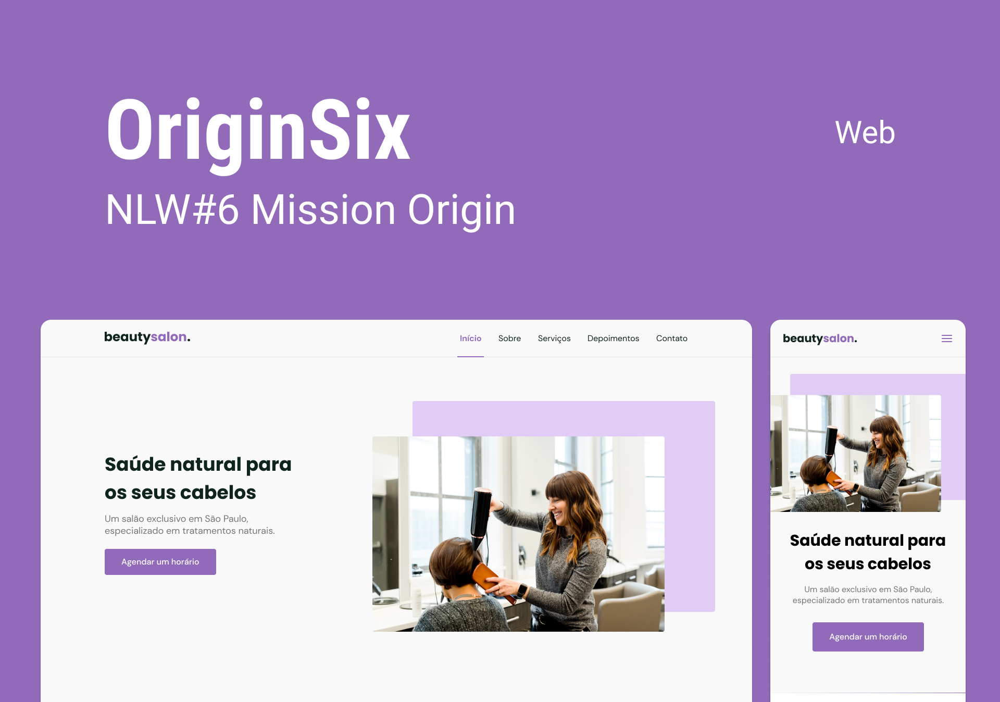

  <a href="#-tecnologias">Technologies</a>&nbsp;&nbsp;&nbsp;|&nbsp;&nbsp;&nbsp;
  <a href="#-project">Projeto</a>&nbsp;&nbsp;&nbsp;|&nbsp;&nbsp;&nbsp;
  <a href="#-layout">Layout</a>&nbsp;&nbsp;&nbsp;|&nbsp;&nbsp;&nbsp;
  <a href="#memo-license">License</a>

 
 

 

  

## 🚀 Tecnologias

This project was developed with the following technologies:

- HTML
- SCSS
- JavaScript

Libraries

- [Google Fonts](https://fonts.google.com/)
- [SwipeJS](https://github.com/nolimits4web/Swiper)
- [ScrollReveal](https://scrollrevealjs.org)

Utilities

- [Unsplash](https://unsplash.com/)
- [RandomUser.me](https://randomuser.me/photos)
- [IconMoon](https://icomoon.io/app/#/select)

## 💻 Project

OriginSix is a responsive One Page format for use in various types of micro, small and medium-sized companies. Contains the following sections: Header, Navigation, Home, About, Services, Testimonials, Contact and Footer.

## 🔖 Layout

You can view the layout of the project through [this link](https://www.figma.com/community/file/1009807319507822993/Origin-Six).

## 📝 License

This project is under the MIT license. See the [LICENSE](.github/LICENSE.md) file for more details.

---
